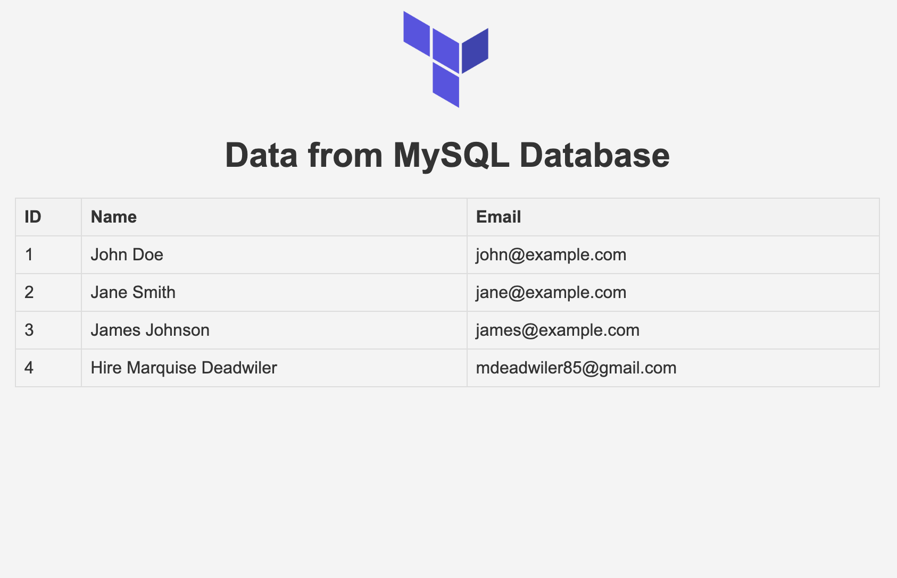

# Node.js MySQL Application with AWS Infrastructure

A Node.js web application connected to MySQL database, deployed on AWS infrastructure using Terraform.

**Note:** This project was forked from [verma-kunal/nodejs-mysql](https://github.com/verma-kunal/nodejs-mysql). I built out the complete AWS infrastructure and automation from scratch.

## Live Demo

The AWS infrastructure for this project has been taken down to avoid ongoing costs. However, all Terraform configuration is included in this repository and can be deployed in minutes using `terraform apply`. 

For interviews or demonstrations, I can spin up the infrastructure on demand.

## What I Built

I took the base Node.js application and created production-ready infrastructure on AWS:

- **Terraform Infrastructure as Code** - All AWS resources defined and managed through Terraform
- **EC2 Instance** - Ubuntu server running the Node.js application
- **RDS MySQL Database** - Managed MySQL instance for data persistence
- **S3 Bucket** - Static asset storage
- **Security Groups** - Network security for EC2 and RDS with proper ingress/egress rules
- **Automated Deployment Script** - Bash script embedded in EC2 user data that fully automates the server setup:
  - Clones the Git repository
  - Installs Node.js and npm
  - Dynamically generates .env file with RDS connection details from Terraform outputs
  - Installs application dependencies
  - All configurations happen automatically on instance launch without manual intervention

## Application Screenshots



## Infrastructure Details

### AWS Resources

**EC2 Instance**
- Instance Type: t3.micro
- OS: Ubuntu (AMI: ami-0360c520857e3138f)
- Auto-assigned public IP for accessibility
- Security group allowing SSH (22), HTTPS (443), and application traffic (3000)

**RDS MySQL**
- Engine: MySQL 8.0
- Instance Class: db.t3.micro
- Database: kunal_demo
- Publicly accessible with restricted security group
- Security group allowing MySQL traffic (3306) from EC2 instance and my local IP

**S3 Bucket**
- Stores static images from the application
- Integrated with EC2 instance deployment

### Security Approach

All sensitive information is managed through Terraform variables and stored in `terraform.tfvars`, which is gitignored:
- Database passwords
- VPC IDs
- Local IP addresses

The infrastructure uses security groups to restrict access:
- RDS only accepts connections from the EC2 security group and my local IP
- EC2 instance is publicly accessible on specific ports only

## Project Structure

```
.
├── terraform/
│   ├── ec2.tf              # EC2 instance and security group
│   ├── rds.tf              # RDS database and security group
│   ├── s3.tf               # S3 bucket configuration
│   ├── variables.tf        # Variable declarations
│   ├── providers.tf        # AWS provider configuration
│   └── terraform.tfvars    # Variable values (gitignored)
├── public/
│   └── index.html          # Frontend application
├── server.js               # Express server
└── .env                    # Environment variables (gitignored)
```

## Local Development Setup

1. Clone the repository
```bash
git clone https://github.com/mdeadwiler/nodejs-mysql.git
cd nodejs-mysql
```

2. Install dependencies
```bash
npm install
```

3. Create a `.env` file in the root directory
```bash
DB_HOST=localhost
DB_USER=root
DB_PASS=your_password
DB_NAME=kunal_demo
TABLE_NAME=users
PORT=3000
```

4. Set up MySQL database locally
```bash
mysql -u root -p

CREATE DATABASE kunal_demo;
USE kunal_demo;

CREATE TABLE users (
    id INT AUTO_INCREMENT PRIMARY KEY,
    name VARCHAR(100) NOT NULL,
    email VARCHAR(100) NOT NULL
);

INSERT INTO users (name, email) VALUES ('John Doe', 'john@example.com');
INSERT INTO users (name, email) VALUES ('Jane Smith', 'jane@example.com');
```

5. Start the development server
```bash
node server.js
```

Access the application at `http://localhost:3000`

## AWS Deployment

### Prerequisites

- AWS CLI configured with credentials
- Terraform installed
- SSH key pair created in AWS (named `terraform-ec2`)

### Deploy Infrastructure

1. Navigate to the terraform directory
```bash
cd terraform
```

2. Create `terraform.tfvars` file
```hcl
db_password = "your_secure_password"
vpc_id = "your_vpc_id"
my_ip = "your_ip/32"
```

3. Initialize Terraform
```bash
terraform init
```

4. Review the plan
```bash
terraform plan
```

5. Apply the infrastructure
```bash
terraform apply
```

6. Once deployed, Terraform outputs the EC2 public IP and RDS endpoint

### Connect to RDS Database

From your local machine:
```bash
mysql -h <rds-endpoint> -u admin -p
```

Create the database schema:
```sql
USE kunal_demo;

CREATE TABLE users (
    id INT AUTO_INCREMENT PRIMARY KEY,
    name VARCHAR(100) NOT NULL,
    email VARCHAR(100) NOT NULL
);

INSERT INTO users (name, email) VALUES ('John Doe', 'john@example.com');
```

### Access the Application

After deployment, access the application at:
```
http://<ec2-public-ip>:3000
```

The EC2 instance automatically:
- Clones this repository
- Installs Node.js and npm
- Creates the .env file with RDS credentials
- Installs dependencies

You may need to SSH into the instance to start the server:
```bash
ssh -i ~/.ssh/terraform-ec2.pem ubuntu@<ec2-public-ip>
cd /home/ubuntu/nodejs-mysql
node server.js
```

## Technical Learnings

Working on this project taught me:
- Writing reusable Terraform modules with proper variable management
- Securing cloud infrastructure with security groups and network isolation
- Handling secrets in IaC without exposing them in version control
- Automating deployment with user data scripts
- Connecting application layers (frontend, backend, database) across AWS services
- Managing RDS MySQL instances and configuring proper access controls

## Cleanup

To avoid AWS charges, destroy the infrastructure when done:
```bash
cd terraform
terraform destroy
```

## Tech Stack

- **Backend:** Node.js, Express
- **Database:** MySQL 8.0
- **Infrastructure:** AWS (EC2, RDS, S3), Terraform
- **Frontend:** HTML, CSS, JavaScript
